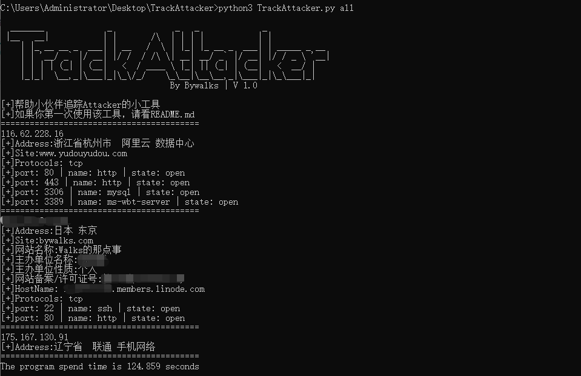

# TrackAttacker V1.0 #

**TrackAttacker** 是一个通过IP追踪攻击者指纹工具

TrackAttacker目前版本为1.0，已满足功能如下
```
1：IP批量
2：IP查域名
3：IP查地址
4：IP查端口
5：IP查主机名
6：域名查备案
7：域名查Whois
```

------

### Install ###

```
python3 -m pip install -r requirements.txt
```

### 开始使用 ###

urls.txt放入需扫描ip

加all参数=加端口扫描

```
python3 TrackAttacker.py3
python3 TrackAttacker.py3 all
```

### 小问题 ###

```
域名查备案用的备案8的接口，该接口需在脚本里手动配置个cookie,so,如果想用该接口，
访问 https://www.beian88.com/, 抓取cookie:eid=b2d7c4b290e086176cdb0ccfbfc162ba，放入脚本中的header头，才可调用域名查备案接口
Why一定通过备案8来域名查备案呢，经过测试，目前发现备案8的接口数据库最广泛，考虑到精准性，最终使用了备案8的接口
```

### 扫描结果 ###


